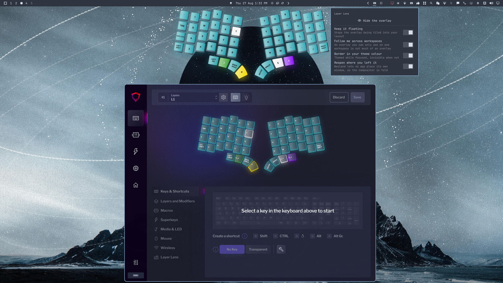

# Bazecor Layer Lens

Window rules for [Bazecor](https://github.com/Dygmalab/Bazecor)'s Layer Lens
overlay, for Omarchy / Hyprland.

Layer Lens draws your current keyboard layer on screen. On Wayland an
application cannot float, pin, or place its own window — those are the
compositor's to decide — so Bazecor cannot make its own overlay behave like one
no matter what it does internally. This plugin supplies the missing half.



*The overlay up top, the plugin's switches on the right, Bazecor itself below.*

## Install

```bash
omarchy plugin add https://github.com/jondkinney/omarchy-bazecor-lens
omarchy bar move io.github.jondkinney.bazecor-lens --section right
omarchy restart shell
```

The restart matters: the service half only starts on a full shell restart,
and `rescanPlugins` alone will not bring it up.

Bazecor needs to be reachable as `bazecor` for the show/hide button. A
packaged install already is; for a local build, either link it onto your PATH
or set `bazecorCommand` in the plugin's entry in `~/.config/omarchy/shell.json`
to the binary's full path.

## Remove

```bash
omarchy plugin remove io.github.jondkinney.bazecor-lens
omarchy restart shell
```

That takes the plugin and its bar entry with it. Nothing is left behind
elsewhere: the plugin never writes to your Hyprland config, and its window
rules are applied at runtime, so they are gone the moment the shell stops.
If you installed the optional launcher entry, remove that too:

```bash
rm ~/.local/share/applications/omarchy-bazecor-lens.desktop
```

## What it does

| Setting | Default | Effect |
|---|---|---|
| Keep the overlay floating | on | Stops the overlay being tiled into your layout |
| Overlay follows you across workspaces | on | Pins it, so it is visible wherever you are |
| Border in your theme colour | on | Themed border while focused, none when not |
| Keep the Bazecor window on its own workspace | on | Only the overlay follows you |

All four are switches in the bar drop-down; the defaults above are what most
people will want.

## Using it

The bar icon dims while the overlay is hidden.

| Action | Effect |
|---|---|
| Left click | Open the drop-down: show/hide, and the switches |
| Right click | Toggle the overlay without opening anything |

Showing and hiding runs `bazecor --toggle-lens`, which reaches the running app
through its single-instance lock — the only route in on Wayland, where a
global shortcut registered by an application never fires. Point
`bazecorCommand` at your binary if Bazecor is not on `PATH`.

## Launcher entry (optional)

The bar icon and the app launcher are separate mechanisms, and installing a
plugin never touches `.desktop` files — so link this one yourself if you want
Layer Lens in the launcher as well as the bar:

```bash
cp ~/.config/omarchy/plugins/io.github.jondkinney.bazecor-lens/omarchy-bazecor-lens.desktop \
   ~/.local/share/applications/
update-desktop-database ~/.local/share/applications
```

Launching it toggles the overlay; its "Layer Lens settings" action opens the
drop-down. Remove it again with:

```bash
rm ~/.local/share/applications/omarchy-bazecor-lens.desktop
```

`Exec` runs `bazecor` through a login shell, so a Bazecor that lives on your
`PATH` only via `~/.profile` (a local build linked into `~/.local/bin`, say) is
still found — a plain `bash -c` inherits the session `PATH`, which typically
has no `~/.local/bin` in it.

## Notes

Rules are applied at runtime rather than written into your Hyprland config, so
nothing here edits files you own. They are re-applied after a config reload —
which is also when a theme change is picked up, so the border colour follows
`omarchy theme set` on its own.

Window rules normally only take effect when a window maps, so each pass also
brings any already-open Bazecor window into line. Toggling a setting takes
effect immediately, without restarting Bazecor.

The overlay is matched on its exact window title, `Dygma Lens`, and the
configurator on `Bazecor`. Both share the `Bazecor` window class, which is why
neither rule matches on class alone.

## Requires

Hyprland 0.55+ (for the Lua configuration API), and a build of Bazecor that
works on Wayland.

### You need my build of Bazecor, for now

Layer Lens does not really work on Wayland in released Bazecor. The overlay
cannot be resized, the Lens key needs several presses before the overlay
appears, and once the overlay window is gone neither the key nor the tray item
brings it back. Those are all fixed in a pull request that is open upstream:

**https://github.com/Dygmalab/Bazecor/pull/1142**

Until that lands, install the build this plugin was tested against:

```bash
./install-bazecor.sh
```

The version and its SHA-256 are pinned in `install-bazecor.sh` in this
repository, so what you end up running is fixed by a file you can read here
rather than by whatever a release currently points at. The download is checked
against that digest and refused outright if it does not match, before the file
is ever made executable, and a download that gets redirected off GitHub's own
hosts is rejected. Already have the AppImage? Pass it as an argument and it is
verified against the same digest without downloading anything.

It installs to `~/.local/share/bazecor/Bazecor.AppImage`, symlinks it as
`~/.local/bin/bazecor` — which is what this plugin's show/hide button runs —
and writes `~/.local/share/applications/bazecor.desktop`. An AppImage does none
of that for itself. It prints that list when it finishes, along with the one
line that undoes all of it.

To run the AppImage yourself instead, set `bazecorCommand` to its full path in
this plugin's entry in `~/.config/omarchy/shell.json`, or the show/hide button
will tell you it cannot find Bazecor. That setting takes one executable name or
absolute path; anything else is refused rather than run.

Layer Lens needs read access to the keyboard over HID. Bazecor offers to
install the udev rules for you the first time it starts and cannot reach the
board; accept, and replug the keyboard.

Prefer to build it yourself? Bazecor's own README covers the build, and the
release notes name the exact commit the AppImage was built from.

Once the PR is merged, any release containing it will do and none of this is
needed — the plugin does not care how Bazecor got there.
